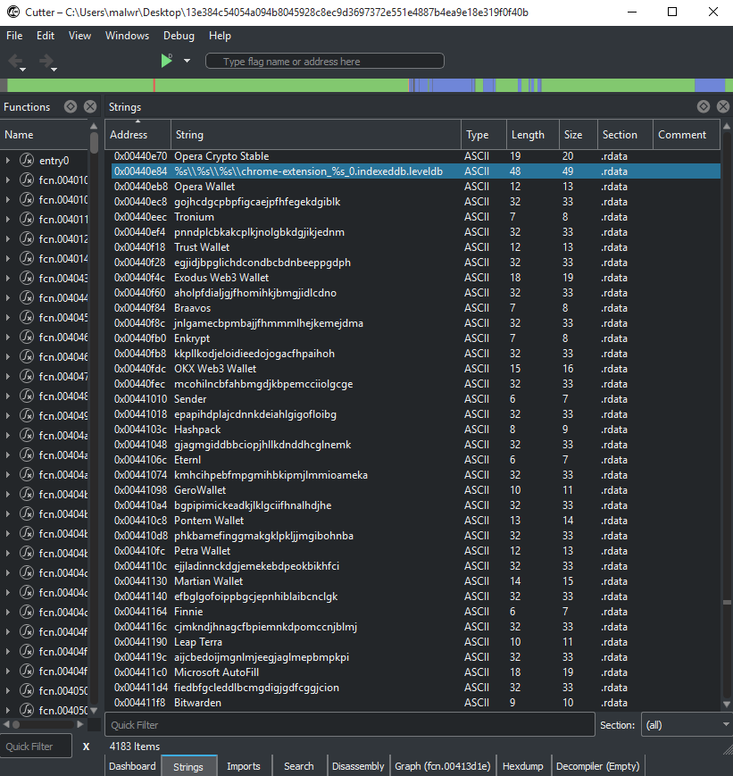

# Day 11: Browser Extensions Targeted by Vidar InfoStealer

Recently Team Cymru published a great research article on Vidar InfoStealer: [Darth Vidar: The Dark Side of Evolving Threat Infrastructure](https://team-cymru.com/post/darth-vidar-the-dark-side-of-evolving-threat-infrastructure)

For todays Yara rule I took a look at the `Vidar 1.9` sample referenced in the above article - `13e384c54054a094b8045928c8ec9d3697372e551e4887b4ea9e18e319f0f40b`. 

While reviewing this malware I noticed 20 strings referencing multiple browser extension IDs for things like cryptocurrency wallets and password managers. Given that these extensions IDs are fairly static in nature I figured this would be a good detection opportunity!



# Yara Rule

Here is the Yara rule that I created for detecting executables targeting browser extensions

```
import "pe"
rule sus_browser_wallet_stealer {
  meta:
    author = "Colin Cowie"
    description = "Detect binaries mentioning high risk browser extensions"
    reference = "https://www.team-cymru.com/post/darth-vidar-the-dark-side-of-evolving-threat-infrastructure"
  strings:
    $Opera  = "gojhcdgcpbpfigcaejpfhfegekdgiblk" // Opera Wallet
    $Tronium = "pnndplcbkakcplkjnolgbkdgjikjednm" // Tronium
    $Trust = "egjidjbpglichdcondbcbdnbeeppgdph" // Trust Wallet
    $Exodus  = "aholpfdialjgjfhomihkjbmgjidlcdno" // Exodus Web3 Wallet
    $Braavos = "jnlgamecbpmbajjfhmmmlhejkemejdma" // Braavos
    $Enkrypt = "kkpllkodjeloidieedojogacfhpaihoh" // Enkrypt
    $OKX = "mcohilncbfahbmgdjkbpemcciiolgcge" // OKX Web3 Wallet
    $Sender = "epapihdplajcdnnkdeiahlgigofloibg" // Sender
    $Hashpack = "gjagmgiddbbciopjhllkdnddhcglnemk" // Hashpack
    $Eternl = "kmhcihpebfmpgmihbkipmjlmmioameka" // Eternl
    $Gero = "bgpipimickeadkjlklgciifhnalhdjhe" // GeroWallet
    $Pontem  = "phkbamefinggmakgklpkljjmgibohnba" // Pontem Wallet
    $Petra  = "ejjladinnckdgjemekebdpeokbikhfci" // Petra Wallet
    $Martian  = "efbglgofoippbgcjepnhiblaibcnclgk" // Martian Wallet
    $Finnie = "cjmkndjhnagcfbpiemnkdpomccnjblmj" // Finnie
    $Leap  = "aijcbedoijmgnlmjeegjaglmepbmpkpi" // Leap Terra
    $AutoFill = "fiedbfgcleddlbcmgdigjgdfcggjcion" // Microsoft AutoFill
    $Bitwarden = "nngceckbapebfimnlniiiahkandclblb" // Bitwarden
    $KeePass  = "fmhmiaejopepamlcjkncpgpdjichnecm" // KeePass Tusk
    $KeePassXC = "oboonakemofpalcgghocfoadofidjkkk" // KeePassXC-Browser
   condition:
    10 of them
    and pe.is_pe

}
```

# Results
Retrohunting with this rule returned pretty high quality results. One of the interesting matches is a Vidar sample from November that uses TikToK for command and control: `2cb532a62bd7fd9acff5f9dd21e1297efc26cf7a`. The C2 used by that sample was mentioned in a writeup published in December: 
- [Vidar Stealer Exploiting Various Platforms](https://asec.ahnlab.com/en/44554/)

# References
- https://team-cymru.com/post/darth-vidar-the-dark-side-of-evolving-threat-infrastructure
- https://asec.ahnlab.com/en/44554/


