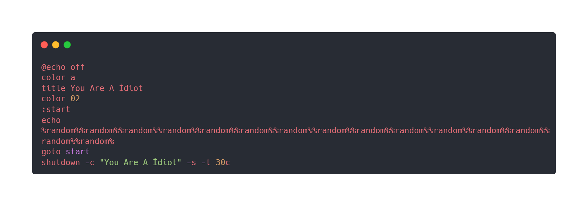

# Day 30 - Internet Short Files & Batch Scripts

After taking a nice long break from both work and #100DaysOfYara lets resume with a rule to detect .url shortcut files that link to a batch script.

Researchers [reported](https://isc.sans.edu/diary/29592) that Qakbot distributed .url files last week:


# Yara Rule
Here's the yara rule I wrote for detecting suspicious shortcut files!

```
rule sus_url_shortcut_bat {
  meta:
    author = "Colin Cowie"
    description = "Detects shortcut url files"
    reference  = "https://isc.sans.edu/diary/29592"
  strings:
  	$shortcut = "[InternetShortcut]" // matches abc
    $url = "URL="
    $bat = ".bat"
  condition:
  	$shortcut at 0
    and all of them
    and filesize<1KB
}

```
# Results

Retrohunting with this rule found a wide variety of results!

Some of the results are legitment files used for product registriation such as:
- [Buy Memory Pictures.url](https://www.virustotal.com/gui/file/a512d1bc6662dd22d01a80313a2e6095c4091dc4568a06bbabd01fe0c0d7dd64)

There were however a lot of malicious results that made use of the DiscordCDN such as this fake crack script that trolls the victim:
- [Valorant_Crack.bat.url](https://www.virustotal.com/gui/file/3781cff32ac2aa249a4d79cc0046ccf4ba92f632dff275eaa98b847c69d288c2/content)



# References
- https://isc.sans.edu/diary/29592


