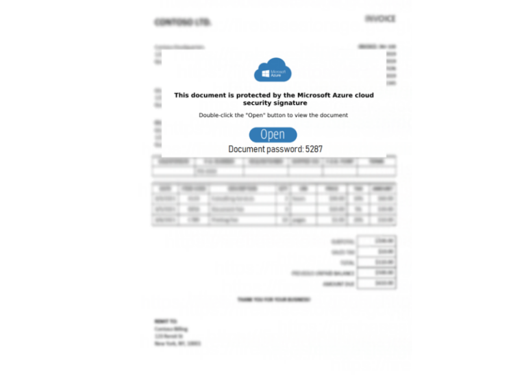

# Day 31 - PDFs Downloaders | IcedID Hunting

Earlier Today IcedID was observed leveraging PDF files that download a malicious archive from google firebase hosting:
- https://github.com/pr0xylife/IcedID/blob/main/icedID_02.03.2023.txt

IcedID seems to really likes using google firebase so todays rule detects PDF files that download a .zip archive from google firebase! 

# Yara Rule
Here's the yara rule I wrote for detecting these IcedID PDFs!

```
rule pdf_with_firebase_zip_link {
  meta:
    author = "Colin Cowie"
    description = "Detects shortcut PDF with firebase zip link"
    reference  = "2"
  strings:
    $pdf_header = {25 50 44 46}
  	$firebase = "firebasestorage.googleapis.com"
    $zip = ".zip"
  condition:
    $pdf_header at 0
    and all of them
}

```
# Results

Retrohunting with this rule quickly found over one thousand recent files! Some of these were IcedID samples from late feburary. Here is a screenshot of the IceID PDF lure:



# References
- https://github.com/pr0xylife/IcedID/blob/main/icedID_02.03.2023.txt
- https://www.garykessler.net/library/file_sigs.html
- https://www.virustotal.com/gui/file/78ae8f5302b095b964372b93c27874a23c0704f21bee6500ad350e9c4a748c4a/content/hex

